# Frontend Board
## 프로젝트 설명
Frontend Board는 Next.js를 기반으로 한 게시판 입니다. 이 프로젝트는 게시물 작성, 게시물 수정, 목록 조회, 댓글 작성 등의 기능을 포함하고 있습니다.

## 기술 스택
- **Next.js:** React 기반의 프레임워크로 서버 사이드 렌더링(SSR)과 정적 사이트 생성(SSG)을 지원합니다.
- **React:** 사용자 인터페이스를 구축하기 위한 JavaScript 라이브러리입니다.
- **Axios:** HTTP 클라이언트로, API 호출을 처리합니다.
- **Apollo Client:** GraphQL 클라이언트로, GraphQL API와 상호작용합니다.
- **Emotion:** CSS-in-JS 라이브러리로 스타일을 작성합니다.
- **TypeScript:** 정적 타입을 제공하는 JavaScript의 상위 집합 언어입니다.
- **Ant Design (antd):** UI 라이브러리로 다양한 컴포넌트와 아이콘을 제공.
- **react-daum-postcode:** Daum 우편번호 검색 서비스를 React에서 사용합니다.
- **react-youtube:** YouTube 동영상을 React 컴포넌트로 쉽게 임베드합니다.
- **ts-node:** TypeScript 파일을 직접 실행할 수 있게 하는 Node.js 도구.

## 프로젝트 구동
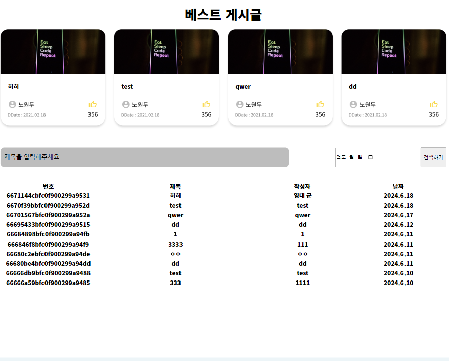
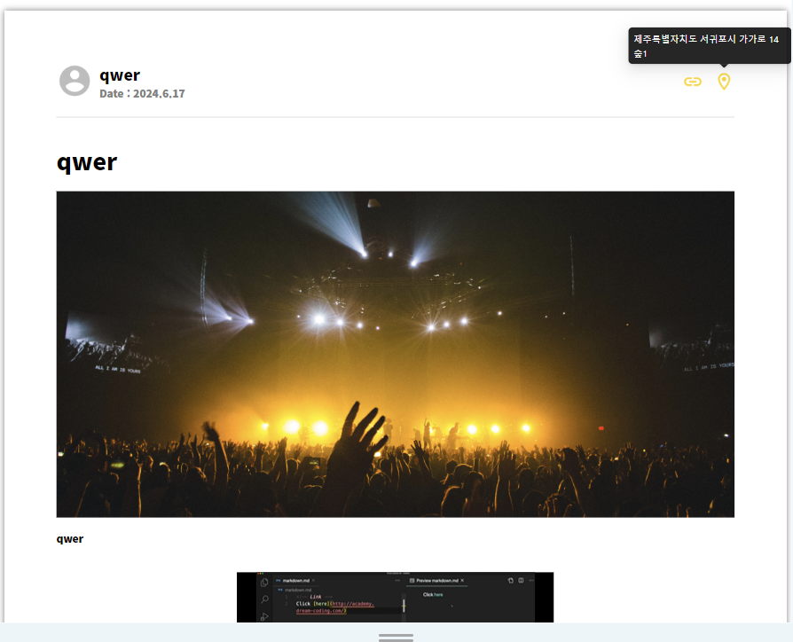
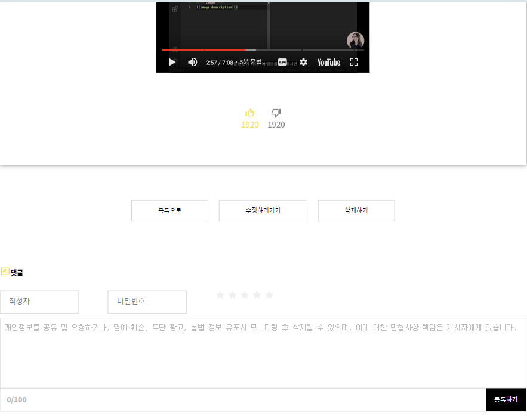
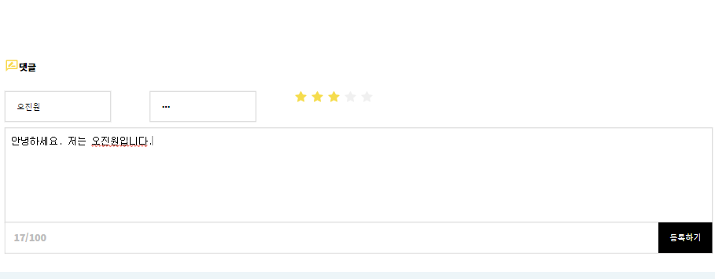
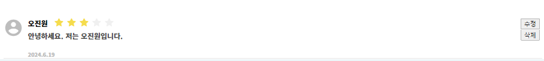
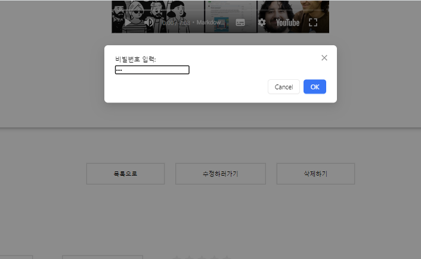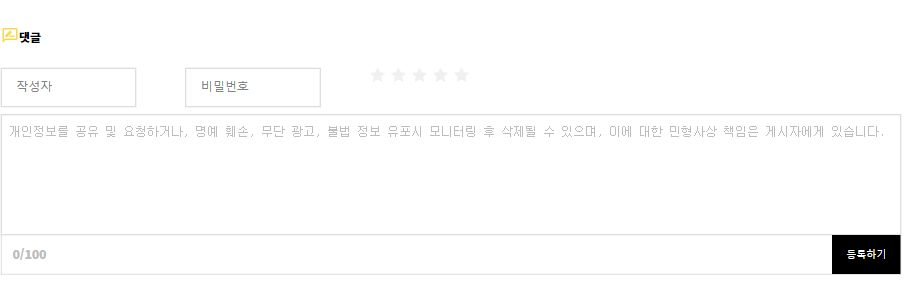
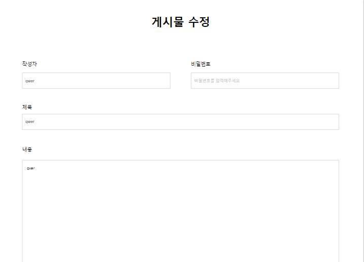
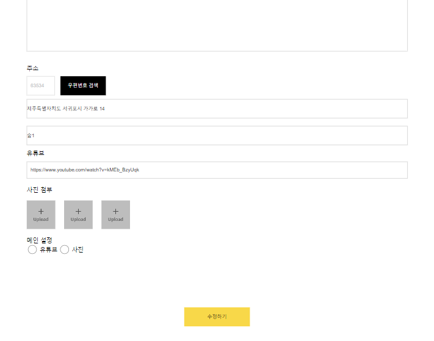
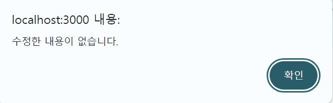
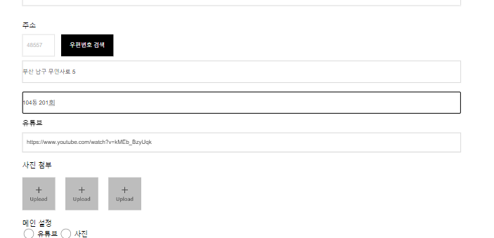
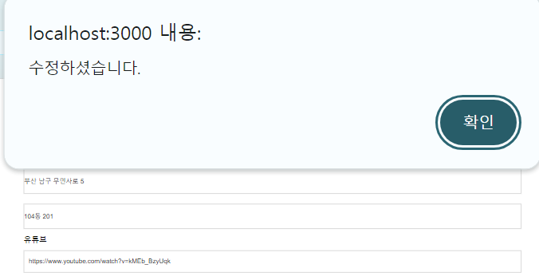
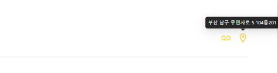
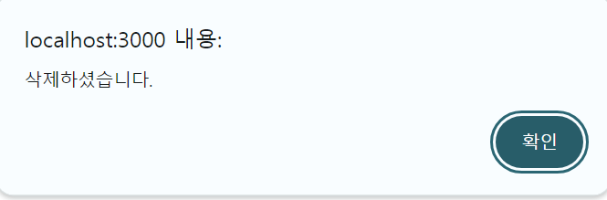
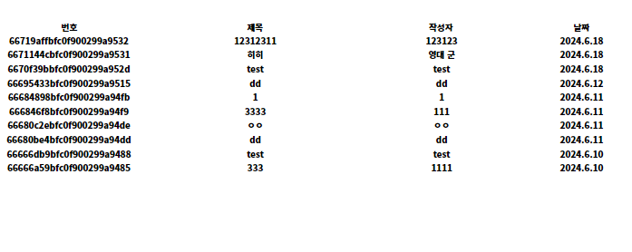

## 프로젝트 구조

![pages/
├── boards/
│ ├── [id]/
│ │ ├── edit/
│ │ │ └── index.tsx
│ │ └── index.tsx
│ ├── list/
│ │ └── index.tsx
│ ├── new/
│ │ └── index.tsx
├── _app.tsx
├── index.tsx](image-3.png)

### 폴더 구조 설명
- **src/commons:**
  - **libraries:** 공통으로 사용하는 라이브러리 코드.
  - **types:** TypeScript 타입 정의 파일.
- **src/components:**
  - **commons:** 재사용 가능한 공통 컴포넌트.
  - **units/board:**
    - **comment:**
      - **list:** 댓글 목록 컴포넌트.
      - **write:** 댓글 작성 컴포넌트.
    - **detail:** 게시물 상세 정보 컴포넌트.
    - **list:** 게시물 목록 컴포넌트.
    - **write:** 게시물 작성 컴포넌트.
- **pages/boards:**
  - **[id]:** 동적 라우팅을 위한 폴더, 특정 게시물의 상세 정보 및 편집 페이지.
    - **edit:** 게시물 편집 페이지.
    - **index.tsx:** 특정 게시물의 상세 정보 페이지.
  - **list:** 게시물 목록 페이지.
  - **new:** 새 게시물 작성 페이지.
- **_app.tsx:** 모든 페이지에 공통으로 적용되는 설정.
- **index.tsx:** 메인 페이지.

## 라이브러리 설명
- **@ant-design/icons, antd:** UI 라이브러리로 다양한 컴포넌트와 아이콘을 제공.
- **@apollo/client:** GraphQL 클라이언트로, GraphQL API와 상호작용.
- **@emotion/react, @emotion/styled:** CSS-in-JS 라이브러리로 스타일을 작성.
- **axios:** HTTP 클라이언트로, API 호출을 처리.
- **graphql:** GraphQL 쿼리 언어를 사용.
- **next:** React 기반의 프레임워크로 서버 사이드 렌더링과 정적 사이트 생성을 지원.
- **react, react-dom:** 사용자 인터페이스를 구축하기 위한 라이브러리.
- **react-daum-postcode:** Daum 우편번호 검색 서비스를 React에서 사용.
- **react-youtube:** YouTube 동영상을 React 컴포넌트로 쉽게 임베드.
- **ts-node:** TypeScript 파일을 직접 실행할 수 있게 하는 Node.js 도구.